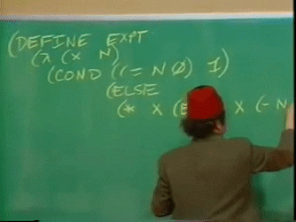
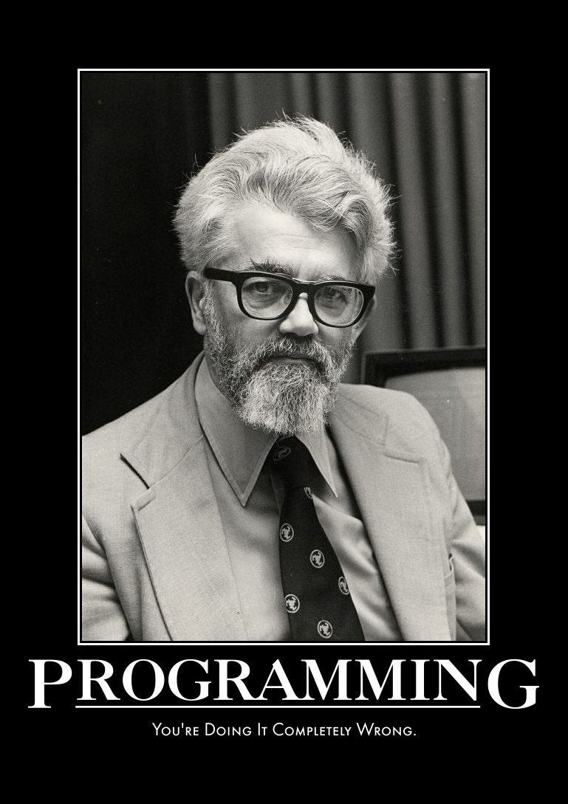

A fork of CLVM to add documentation and explanation.



The CLVM is built upon primary concepts of LISP such as Atoms, Pairs, and S-expression so those are explained here in detail. 

# CLVMObject 

It appears as if the primary unit of the CLVM is the CLVMObject.

A [CLVM object](https://github.com/b0mTrady/clvm/blob/develop/clvm/CLVMObject.py#L2) is a:

> minimal `SExp` type that defines how and where its contents are stored in the heap.


### What Is A Symbolic Expression?

LISP (LISt Processor) has been [credited to John McCarthy](http://www-formal.stanford.edu/jmc/recursive.pdf), a man of many opinions:




SExp stands for [S-expression](https://www.cs.unm.edu/~luger/ai-final2/LISP/CH%2011_S-expressions,%20The%20Syntax%20of%20Lisp.pdf). An S-expression or Symbolic Expression is commonly understood as *a way to represent a nested list* though the [Wizard](https://web.mit.edu/alexmv/6.037/sicp.pdf) tells us that symbolic expressions are:

> data whose elementary parts can be arbitrary symbols rather than only numbers (p. 90) 

The printed representation of both atoms and list

*For further exploration see page 100 - 104 of the [Wiz](https://web.mit.edu/alexmv/6.037/sicp.pdf)*

### CLVMObject Class

Below we see the CLVMObject class in [CLVMObject.py](https://github.com/b0mTrady/clvm/blob/develop/clvm/CLVMObject.py) which makes extensive use of the [typing library](https://docs.python.org/3/library/typing.html) for type hints. 

```python

class CLVMObject:
    atom: typing.Optional[bytes]
    pair: typing.Optional[typing.Tuple["CLVMObject", "CLVMObject"]]
    __slots__ = ["atom", "pair"]
```

Line by line we find:

### What is An Atom? 

The definition of an atom is as confusing as the conflicting definitions available from trusted sources. 


In the [Wiz](https://web.mit.edu/alexmv/6.037/sicp.pdf) an atom is defined as "not a pair." 

[GNU](https://www.gnu.org/software/emacs/manual/html_node/eintr/Lisp-Atoms.html#:~:text=In%20Lisp%2C%20what%20we%20have%20been%20calling%20words%20are%20called%20atoms.&text=Technically%20speaking%2C%20a%20list%20in,nothing%20in%20it%20at%20all.) waxes philosophically about the physics meaning of an atom but does not definitively define the term. Instead they tell us nobody uses the term even though they are making an attempt to define it:

>  the word “atom” is not often used, because programmers usually try to be more specific about what kind of atom they are dealing with.

though we are given examples of LISP atoms:
*  37
*  511
*  1729
*   ‘+’
*   ‘foo’
*   ‘forward-line’

```python 
     atom: typing.Optional[bytes]
```

Create an instance of a CLVMObject that is an atom of type [bytes] or None (???) 

[Optional[bytes]](https://docs.python.org/3/library/typing.html#typing.Optional) is equivalent to [Union[bytes, None]](https://docs.python.org/3/library/typing.html#typing.Union) 
   * Union[X, Y] means either X or Y

### What Is A Pair? 

```python
  pair: typing.Optional[typing.Tuple["CLVMObject", "CLVMObject"]]
```
A pair is a "general purpose building block" used to "create all sorts of complex data structure." 
Objects constructed from pairs are often called "list-structured data." 

* Create an instance of CLVMObject that is a pair of tuple of two CLVMObjects each with their own type (???) 
* [typing.Tuple](https://docs.python.org/3/library/typing.html#typing.Tuple) - Tuple[X, Y] is the type of a tuple of two items with the first item of type X and the second of type Y.
* Example: Tuple[int, float, str] is a tuple of an int, a float and a string.


### Slots ???? 

```python
   __slots__ = ["atom", "pair"]
```
* According to [Guido](http://python-history.blogspot.com/2010/06/inside-story-on-new-style-classes.html) the dunder method __slots__:
  *  > restricts the valid set of attribute names on an object to exactly those names listed 
  *  > since the attributes are now fixed, it is no longer necessary to store attributes in an instance dictionary, so the __dict__ attribute is removed  
  *  > my ultimate goal was performance
*  The memory savings utilizing __slots__ has shown [varying amounts of memory optimization](https://stackoverflow.com/questions/472000/usage-of-slots)

The code continues: 

```python
###########
class CLVMObject:
    atom: typing.Optional[bytes]
    pair: typing.Optional[typing.Tuple["CLVMObject", "CLVMObject"]]
    __slots__ = ["atom", "pair"]
###########

    def __new__(class_, v: "SExpType"):
        if isinstance(v, CLVMObject):
            return v
        if TYPE_CHECK:
            type_ok = (
                isinstance(v, tuple)
                and len(v) == 2
                and isinstance(v[0], CLVMObject)
                and isinstance(v[1], CLVMObject)
            ) or isinstance(v, bytes)
            # uncomment next line for debugging help
            # if not type_ok: breakpoint()
            assert type_ok
        self = super(CLVMObject, class_).__new__(class_)
        if isinstance(v, tuple):
            self.pair = v
            self.atom = None
        else:
            self.atom = v
            self.pair = None
        return self

    def cons(self, right: "CLVMObject"):
        return self.__class__((self, right))


SExpType = typing.Union[bytes, typing.Tuple[CLVMObject, CLVMObject]]

```
